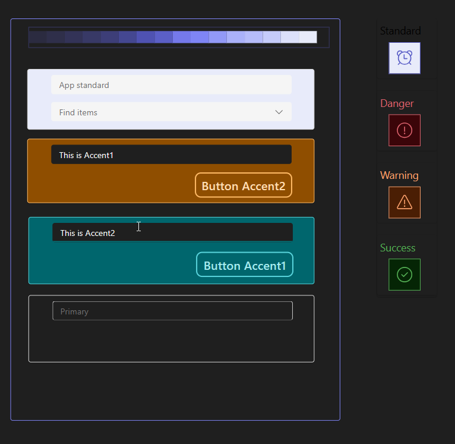

# The purpose
This PCF is intended to be used to Canvas Apps or CustomPages in Power Apps.
This should provide access to all the colors or theming tokes from Fluent UI 9 context and make the work with Theming easier.
This colors can be used by LowCode components in CanvasApps.

The PCF is not intended to override the Theming in Power Apps, but as a help to deal with colors around the theming you choose.

# PreRequires
The Canvas App or Custom Page must have the feature "Modern controls and themes" activated


# How to use
Just import the PCF "ThemingColors" in your organization and enable PCFs.
All you have to do is to add the ThemingColors to your app


There are two ways to use it.

## Using the global variable "ExtendedTheme"
As soon the component in used in your app (just drag it somewhere on your screen, it's a transparent element), you can directly use the global variable ExtendedTheme.


This variable is providing a set of pre-defined colors. You can find the list of colors by inspecting the the ThemingColors event "OnColorChanged".
The current definition is looking like this, but you can change it as you wish.


## Using the output property OutputTheme
The OuputTheme property of the PCF is providing the complete theme defined in the App.
The complete list of Fluent UI 9 theming tokens can be [found here](https://react.fluentui.dev/?path=/docs/theme-colors--docs).
In case you use the OutputTheme property for colors, you need to wrap the colors in a call of the ColorValue() function. 

Example: this could be the expression for the "Fill" or "BasePaletteColor" of a control:
```
ColorValue(ThemingColors1.OutputTheme.colorPaletteDarkOrangeForeground1)
```

# Customizing Options

## Accent Colors

Additionally you can define two more accent colors. For each of them could be the Background, Foreground and Border colors.


The colors could be color tokens from the Theme (as documented in the Fluent 9 theming colors) or the code of the color you want to define.


If possible, it's better to take the Fluent 9 token instead of the hardcoded colors, since that colors are automatically adapted if you want to switch to dark mode.

These accent colors can be found in the OutputTheme property and is defined also in the ExtendedTheme global variable:


That way you can define a set of 2 accent colors additionally to the primary color.

## Dark Mode
Even if the controls in Canvas Apps are not really ready for dark mode, this PCF should help you face some problems in a consistent way.
Just set the PCF property "IsDarkMode" to true, and the colors from the main Theme will adapt to dark mode. Even the base color gets adapted to dark mode.

Example: Teams Theme with accents on Peach and LightTeal

And the same in dark mode


The **Danger**, **Warning** and **Success** icons, are made using the colors:
```
    ErrorBackground : ColorValue(Self.OutputTheme.colorStatusDangerBackground1), 
    ErrorForeground: ColorValue(Self.OutputTheme.colorStatusDangerForeground1), 
    ErrorBorder: ColorValue(Self.OutputTheme.colorStatusDangerBorder1),    
    WarningBackground : ColorValue(Self.OutputTheme.colorStatusWarningBackground1), 
    WarningForeground: ColorValue(Self.OutputTheme.colorStatusWarningForeground1), 
    WarningBorder: ColorValue(Self.OutputTheme.colorStatusWarningBorder1), 
    SuccessBackground: ColorValue(Self.OutputTheme.colorStatusSuccessBackground1),
    SuccessForegroud: ColorValue(Self.OutputTheme.colorStatusSuccessForeground1),
    SuccessBorder: ColorValue(Self.OutputTheme.colorStatusSuccessBorder1),
```
which are also available by default through ExtendedTheme global variable


## Changing the content of variable ExtendedTheme

You have two ways to change this. 
You could just pick the OnColorChanged event of the PCF, and change the content. 

**Just remember that you need to make a change in order to work with the changed ExtendedTheme variable. The change can be triggered by chaning any of the input properties: isDarkMode or the other accent colors definition. You can change that back afterwards.**


The other way would be to modify the PCF, locate the event in the manifest, make the changes and make your own PCF solution. 
That way, you can reuse the same default setup for later projects/pages/apps.
```xml
<event name="OnColorChanged" display-name-key="OnColorChanged"     
    description-key="OnColorChanged" 
    pfx-default-value='Set(ExtendedTheme, {
        ErrorBackground : ColorValue(Self.OutputTheme.colorStatusDangerBackground1), 
        ErrorForeground: ColorValue(Self.OutputTheme.colorStatusDangerForeground1), 
    ...'
    </event>
```